<picture>
  <source media="(prefers-color-scheme: dark)" srcset="./assets/header-dark.svg">
  <source media="(prefers-color-scheme: light)" srcset="./assets/header-light.svg">
  
</picture>

  
  

## About

I build end-to-end software systems across **product, backend, data, applied AI and infrastructure** — from understanding the domain and defining constraints to architecture, implementation, delivery and operation.

My current work is centered on **data-intensive applications, operational tooling, AI-assisted systems and automation**. I favor explicit contracts, measurable behavior and clear deterministic boundaries around probabilistic systems.

## Toolbox

  <picture>
    <source media="(prefers-color-scheme: dark)" srcset="https://skillicons.dev/icons?i=ts,python,react,nextjs,nodejs,postgres,supabase,docker,linux,githubactions&theme=dark">
    <source media="(prefers-color-scheme: light)" srcset="https://skillicons.dev/icons?i=ts,python,react,nextjs,nodejs,postgres,supabase,docker,linux,githubactions&theme=light">
    
  </picture>

**Languages**  
`TypeScript` · `JavaScript` · `Python` · `SQL` · `Go`

**Application**  
`React` · `Next.js` · `Node.js` · `Express` · `NestJS` · `React Native` · `Expo`

**Data & Messaging**  
`PostgreSQL` · `Supabase` · `Prisma` · `MongoDB` · `RabbitMQ` · `Power BI`

**AI Systems**  
`LLM APIs` · `Model Routing` · `Agent Workflows` · `Tool Integration`

**Infrastructure**  
`Docker` · `Linux` · `Azure` · `Oracle Cloud` · `AWS S3` · `Railway` · `Vercel` · `Tailscale`

**Quality & Delivery**  
`GitHub Actions` · `Playwright` · `Vitest` · `Jest` · `Lighthouse` · `Axe` · `Sentry`

<strong>Extended toolbox</strong>

 

**UI & Application tooling**  
`Tailwind CSS` · `Vite` · `shadcn/ui` · `Radix UI` · `Framer Motion` · `TanStack Query` · `React Hook Form` · `Zod` · `Auth.js / NextAuth` · `Socket.IO`

**Engineering & Operations**  
`Puppeteer` · `Webpack` · `Babel` · `ESLint` · `Prettier` · `Husky` · `pnpm` · `npm` · `Bash` · `PowerShell` · `tmux` · `systemd`

**Integrations & services**  
`Nodemailer / SMTP` · `REST APIs` · `WebSockets` · `PWA / Service Workers`

